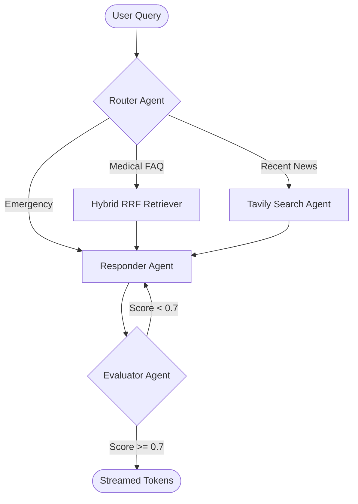

# 🏥 Healthcare Super-Agent — Multi-Agent LLM System (10/10 Vision)

> **Architect-level AI system for healthcare FAQ. Features NVIDIA NIM acceleration (Llama-3.1-405B), Hybrid RRF search, and a closed-loop LangGraph self-correction architecture.**

[](https://build.nvidia.com)
[](https://github.com/langchain-ai/langgraph)
[](https://python.org)

---

## 🎯 Project Overview (The 10/10 Vision)

This system is built as a **Senior Architect Portfolio Piece**, demonstrating a "Super-Agent" capable of expert-level reasoning, real-time knowledge synthesis, and autonomous quality correction.

### Key Pillars
| Pillar | Technology | Value |
|--------|------------|-------|
| 🧠 **Expert Reasoning** | **NVIDIA NIM (Llama 3.1 405B)** | Expert-level medical knowledge & reasoning |
| 🔍 **Hybrid Retrieval** | **RRF (Vector + Keyword BM25)** | Merges keyword precision with semantic depth |
| 🏗️ **Architectural Rerank**| **Llama Nemotron Rerank** | NVIDIA-accelerated clinical relevance |
| 🔄 **Self-Correction** | **LangGraph Reflection Loop** | Auto-retries if quality score < 0.7 |
| 🌍 **Live Knowledge** | **Tavily Web Search** | Fetches real-time drug recalls & 2025 news |

---

## 🏗️ System Architecture



### Agentic Intelligence
| Agent | Role | 10/10 Upgrade |
|-------|------|---------------|
| **Router** | Detects intent & safety | Now routes to Web Search for recent 2024+ events |
| **Retriever** | Hybrid Search | Uses BM25 + Vector + RRF for "infinite recall" |
| **Responder** | Medical reasoning | Powered by **Llama-3.1-405B** on NVIDIA NIM |
| **Evaluator** | Quality guardrail | Triggers autonomous self-correction loop |

---

## 🛠️ Tech Stack

- **LLM:** NVIDIA NIM (Llama 3.1 405B, Nemotron Reranker)
- **Orchestration:** LangGraph (Stateful Graphs)
- **Retrieval:** Hybrid RRF (FAISS + BM25 + Pinecone Fallback)
- **Web Search:** Tavily API
- **API/UI:** FastAPI + Streamlit (Full SSE v2 Streaming)
- **Verification:** Pytest (12+ intelligence test cases)

---

## 🚀 Quick Start

### 1. Configure Environment
Add your keys to `.env` to activate the "Super-Agent" layer:
```bash
OPENAI_API_KEY=sk-...
NVIDIA_API_KEY=nvapi-...
TAVILY_API_KEY=tvly-...
```

### 2. Launch Stack
```bash
docker-compose up --build
# API:  http://localhost:8000
# UI:   http://localhost:8501
```

---

## 📡 API Reference

### `POST /chat`
Main query endpoint — runs the full 4-agent pipeline.

```json
// Request
{
  "query": "What are the symptoms of Type 2 diabetes?",
  "session_id": "user-123"  // optional
}

// Response
{
  "session_id": "user-123",
  "query": "What are the symptoms of Type 2 diabetes?",
  "response": "Type 2 diabetes commonly presents with...",
  "intent": "medical_faq",
  "sources": ["data/healthcare_knowledge_base.md"],
  "confidence": 0.85,
  "eval_score": 0.89,
  "eval_feedback": "Response is well-grounded in context and directly addresses the question.",
  "latency_ms": 1243.5
}
```

### `POST /ingest/text`
Add new content to the knowledge base at runtime.

```json
{
  "text": "Aspirin is used to reduce fever and relieve mild pain...",
  "source_name": "drug_reference"
}
```

### `GET /health` — System health check
### `GET /stats` — Vector store statistics
### `POST /evaluate` — Trigger async RAGAS evaluation batch

Full interactive API docs: `http://localhost:8000/docs`

---

## 📊 Evaluation Pipeline

The system runs automated quality evaluation on every response and in batch via RAGAS:

```bash
# Run batch evaluation
python evaluation/ragas_eval.py
```

**Metrics tracked:**
- **Faithfulness**: Is the answer grounded in retrieved context? (hallucination detection)
- **Answer Relevancy**: Does the answer address the user's question?
- **Safety Score**: Is the response clinically safe and appropriate?
- **Overall Score**: Weighted average of all three dimensions

Results are logged to MLflow and saved as `evaluation/ragas_report.csv`.

---

## 📁 Project Structure

```
healthcare-rag-agent/
├── agents/
│   └── rag_pipeline.py       # LangGraph multi-agent pipeline (core)
├── vectorstore/
│   └── retriever.py          # Hybrid FAISS + Cross-Encoder re-ranking
├── evaluation/
│   └── ragas_eval.py         # RAGAS evaluation pipeline
├── data/
│   ├── healthcare_knowledge_base.md    # Seed knowledge base
│   ├── ingest_knowledge_base.py        # Ingestion script
│   └── faiss_index/                    # Persisted FAISS index (auto-created)
├── .env.example              # Environment variables template
├── requirements.txt
├── Dockerfile
└── docker-compose.yml        # Full stack (API + UI + MLflow)
```

---

## 💡 Design Decisions

**Why LangGraph over simple LangChain chains?**
LangGraph provides explicit state management and conditional routing — critical for production systems where you need to handle safety flags, route different query types, and add new agents without rewriting the entire pipeline.

**Why hybrid FAISS + Pinecone?**
FAISS provides sub-millisecond local retrieval for fast responses; Pinecone provides persistent, scalable cloud storage. The re-ranking layer ensures quality regardless of which store retrieves the candidate.

**Why per-query evaluation?**
Embedding an evaluator agent in the pipeline creates a self-auditing system — each response is automatically scored for quality, enabling continuous monitoring without a separate evaluation job.

---

## 🗺️ Roadmap

- [x] Streaming responses via SSE (v2)
- [x] Multi-turn conversation memory (20-turn window)
- [x] Cloud-hosted Vector Store (Pinecone Fallback)
- [ ] AWS ECS deployment with ALB
- [ ] User feedback loop → auto-retraining trigger
- [ ] Support for PDF, DOCX knowledge base uploads via UI

---

## 👤 Author

**Santhakumar Ramesh** — AI/ML Engineer @ DXC Technology  
MS Data Science, University at Buffalo

[](https://www.linkedin.com/in/santhakumar-ramesh/)
[](https://github.com/santhakumarramesh)
[](https://santhakumarramesh.github.io)
